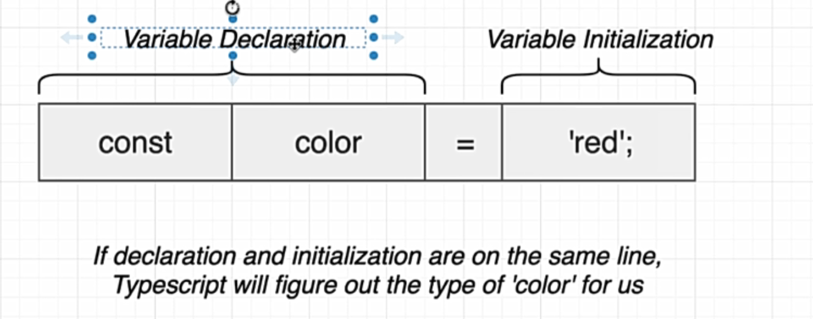

# Typescript 学习

## Types

Easy way to refer to the different properties + function that a value has

string : 'hi' "" "today is the day"

number : -20 400

boolean : true false

Date : new Date()

Todo :  {- -  -}

- primitive types: null string undefined boolean symbol number
- object types : functions arrays classes objects

1. types are used by the typescript compiler to analyze our code for errors
2. types allow other engineers to understand what values are flowing around our codebase

## Where do we use types

Everywhere actually

## annotations&inference

annotations: we tell typescript what the type is

inference: typescript gusses the type

